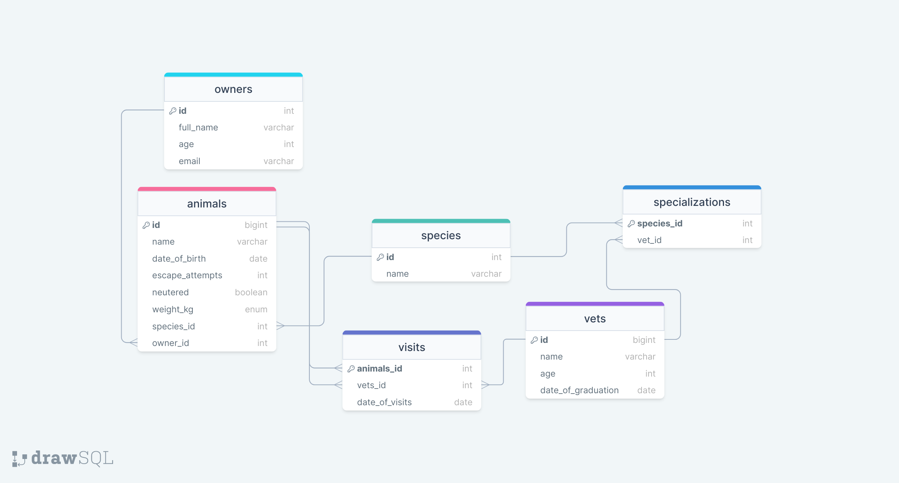

<!-- TABLE OF CONTENTS -->

# 📗 Table of Contents

- [📖 About the Project](#about-project)
  - [🛠 Built With](#built-with)
    - [Tech Stack](#tech-stack)
    - [Key Features](#key-features)
  <!-- - [🚀 Live Demo](#live-demo) -->
- [💻 Getting Started](#getting-started)
  - [Setup](#setup)
  <!-- - [Prerequisites](#prerequisites)
  - [Install](#install)
  - [Usage](#usage)
  - [Run tests](#run-tests)
  - [Deployment](#triangular_flag_on_post-deployment) -->
- [👥 Authors](#authors)
- [🔭 Future Features](#future-features)
- [🤝 Contributing](#contributing)
- [⭐️ Show your support](#support)
- [🙏 Acknowledgements](#acknowledgements)
<!-- - [❓ FAQ](#faq) -->
- [📝 License](#license)

<!-- PROJECT DESCRIPTION -->

# 📖 [Vet-Clinic-DB] <a name="about-project"></a>

**[Vet-Clinic-DB]** is a website for testing PostgreSQL, while creating a table, inserting data and querying data.

## 🛠 Built With <a name="built-with"></a>

### Tech Stack <a name="tech-stack"></a>

> PostgreSQL, pgAdmin.

<!-- <details>
  <summary>Client</summary>
  <ul>
    <li><a href="https://reactjs.org/">React.js</a></li>
  </ul>
</details>

<details>
  <summary>Server</summary>
  <ul>
    <li><a href="https://expressjs.com/">Express.js</a></li>
  </ul>
</details> -->

<details>
<summary>Database</summary>
  <ul>
    <li><a href="https://www.postgresql.org/">PostgreSQL</a></li>
  </ul>
</details>

<!-- Features -->

### Key Features <a name="key-features"></a>

- **[Created table]**
- **[Inserted data into table]**
- **[Queried data from the table]**

<p align="right">(<a href="#readme-top">back to top</a>)</p>

<!-- LIVE DEMO -->

<!-- ## 🚀 Live Demo <a name="live-demo"></a>

> Add a link to your deployed project.

- [Live Demo Link](<replace-with-your-deployment-URL>)

<p align="right">(<a href="#readme-top">back to top</a>)</p> -->

<!-- GETTING STARTED -->

## Getting Started

This repository includes files with plain SQL that can be used to recreate a database:

- Use [schema.sql](./schema.sql) to create all tables.
- Use [data.sql](./data.sql) to populate tables with sample data.
- Check [queries.sql](./queries.sql) for examples of queries that can be run on a newly created database. **Important note: this file might include queries that make changes in the database (e.g., remove records). Use them responsibly!**


<!-- To get a local copy up and running, follow these steps.

### Prerequisites

In order to run this project you need: --> -->

<!--
Example command:

```sh
 gem install rails
```
 -->

### Setup

Clone this repository to your desired folder:

<!--
Example commands:

```sh
  cd my-folder
  git clone git@github.com:myaccount/my-project.git
```
--->

<!-- ### Install

Install this project with: -->

<!--
Example command:

```sh
  cd my-project
  gem install
```
--->

<!-- ### Usage

To run the project, execute the following command: -->

<!--
Example command:

```sh
  rails server
```
--->

<!-- ### Run tests

To run tests, run the following command: -->

<!--
Example command:

```sh
  bin/rails test test/models/article_test.rb
```
--->

<!-- ### Deployment

You can deploy this project using: -->

<!--
Example:

```sh

```
 -->

<!-- <p align="right">(<a href="#readme-top">back to top</a>)</p> -->

<!-- AUTHORS -->

## 👥 Authors <a name="authors"></a>

👤 **Rabaya Rabu**

- GitHub: [@rabayarabu](https://github.com/rabayarabu)
- Twitter: [@rabaya_rabu](https://twitter.com/rabaya_rabu)
- LinkedIn: [LinkedIn](https://linkedin.com/in/rabaya-rabu-142721169/)

<!-- 👤 **Author2**

- GitHub: [@githubhandle](https://github.com/githubhandle)
- Twitter: [@twitterhandle](https://twitter.com/twitterhandle)
- LinkedIn: [LinkedIn](https://linkedin.com/in/linkedinhandle) -->

<p align="right">(<a href="#readme-top">back to top</a>)</p>

<!-- FUTURE FEATURES -->

## 🔭 Future Features <a name="future-features"></a>

- [ ] **[join table]**
<!-- - [ ] **[new_feature_2]**
- [ ] **[new_feature_3]** -->

<p align="right">(<a href="#readme-top">back to top</a>)</p>

<!-- CONTRIBUTING -->

## 🤝 Contributing <a name="contributing"></a>

Contributions, issues, and feature requests are welcome!

Feel free to check the [issues page](https://github.com/rabayarabu/vet_clinic_db/issues).

<p align="right">(<a href="#readme-top">back to top</a>)</p>

<!-- SUPPORT -->

## ⭐️ Show your support <a name="support"></a>

If you like this project you can appriciate my work and share.

<p align="right">(<a href="#readme-top">back to top</a>)</p>

<!-- ACKNOWLEDGEMENTS -->

## 🙏 Acknowledgments <a name="acknowledgements"></a>

I would like to thank Microverse and the whole team.

<p align="right">(<a href="#readme-top">back to top</a>)</p>

<!-- FAQ (optional) -->

<!-- ## ❓ FAQ <a name="faq"></a>

> Add at least 2 questions new developers would ask when they decide to use your project.

- **[Question_1]**

  - [Answer_1]

- **[Question_2]**

  - [Answer_2]

<p align="right">(<a href="#readme-top">back to top</a>)</p> -->

<!-- LICENSE -->

## 📝 License <a name="license"></a>

This project is [MIT](./LICENSE) licensed.

<p align="right">(<a href="#readme-top">back to top</a>)</p>
